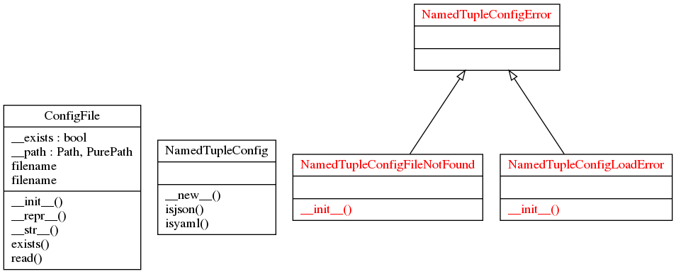

# conf2tuple
## Description:

This package loads the configuration values defined in external JSON or
YAML file, not the built-in data structures.

## Setup:

```shell
$ git clone https://github.com/francois-le-ko4la/python-conf2tuple.git
$ cd python-conf2tuple
$ make install
```

## Test:

This module has been tested and validated on Ubuntu.
```shell
$ make test
```

## Use:

```python
from conf2tuple import NamedTupleConfig
conf = "/path/to/the/file"
# NamedTupleConfig(path (str), NamedTupleConfig.{isjson|isyaml})
config = NamedTupleConfig(conf, NamedTupleConfig.isjson)
print(config)
```

## Project Structure
```
.
├── conf2tuple
│   ├── __about__.py
│   ├── config.py
│   ├── exceptions.py
│   ├── file.py
│   └── __init__.py
├── last_check.log
├── LICENSE
├── Makefile
├── pictures
│   ├── classes_conf2tuple.png
│   └── packages_conf2tuple.png
├── README.md
├── runtime.txt
├── setup.cfg
├── setup.py
└── tests
    ├── facebook.json
    ├── facebook.yaml
    ├── test_doctest.py
    └── test_pycodestyle.py
```

## Todo:

- [X] Create the project
- [X] Write code and tests
- [X] Test installation and requirements (setup.py and/or Makefile)
- [X] Test code
- [X] Validate features
- [X] Write Doc/stringdoc
- [X] Run PEP8 validation
- [X] Clean & last check
- [X] Fix global header
- [X] Fix tests
- [X] Fix doc
- [X] Release : 1.0.0

## License

This package is distributed under the [GPLv3 license](./LICENSE)
### Runtime

```

python-3.6.x


```

### UML Diagram



### Objects

[NamedTupleConfig()](#namedtupleconfig)<br />
[NamedTupleConfig.isjson()](#namedtupleconfigisjson)<br />
[NamedTupleConfig.isyaml()](#namedtupleconfigisyaml)<br />
[NamedTupleConfigError()](#namedtupleconfigerror)<br />
[NamedTupleConfigFileNotFound()](#namedtupleconfigfilenotfound)<br />
[NamedTupleConfigLoadError()](#namedtupleconfigloaderror)<br />
[ConfigFile()](#configfile)<br />
[@Property ConfigFile.filename](#property-configfilefilename)<br />
[ConfigFile.exists()](#configfileexists)<br />
[ConfigFile.read()](#configfileread)<br />


#### NamedTupleConfig()
```python
class NamedTupleConfig():
```

```
This Class provides a namedtuple from a JSON File or YAML file.
You can use it to avoid a lot of CONST in your scripts.

Use:
    >>> # pathlib to run the test everywhere
    >>> import pathlib
    >>> path = str(pathlib.Path(__file__).resolve().parent) + "/"
    >>> cur_file = path + '../tests/facebook.json'
    >>> json = NamedTupleConfig(cur_file, NamedTupleConfig.isjson)
    >>> print(json.config)
    Config(description='Facebook APP API - create an application before using this profile', debug=True, data={'host': 'https://graph.facebook.com', 'token': ['OAuth', 'XXXXX TOKEN XXXXX']})
    >>> cur_file = path + '../tests/facebook.yaml'
    >>> yaml = NamedTupleConfig(cur_file, NamedTupleConfig.isyaml)
    >>> yaml.config.data['host']
    'https://graph.facebook.com'
    >>> # oups 1: file not found
    >>> cur_file = '/etc/fst'
    >>> config = NamedTupleConfig(cur_file, NamedTupleConfig.isjson)
    Traceback (most recent call last):
    ...
    conf2tuple.exceptions.NamedTupleConfigFileNotFound: File "/etc/fst" not found!
    >>> # oups 2: can't load the file
    >>> cur_file = path + '../LICENSE'
    >>> config = NamedTupleConfig(cur_file, NamedTupleConfig.isjson)
    Traceback (most recent call last):
    ...
    conf2tuple.exceptions.NamedTupleConfigLoadError: Can't load the configuration...
```

##### NamedTupleConfig.isjson()
```python
@staticmethod
def NamedTupleConfig.isjson():
```
> <br />
> use it to define the file type<br />
> <br />
##### NamedTupleConfig.isyaml()
```python
@staticmethod
def NamedTupleConfig.isyaml():
```
> <br />
> use it to define the file type<br />
> <br />
#### NamedTupleConfigError()
```python
class NamedTupleConfigError(Exception):
```

```
Generic exception.
```

#### NamedTupleConfigFileNotFound()
```python
class NamedTupleConfigFileNotFound(NamedTupleConfigError):
```

```
Config file is not found
```

#### NamedTupleConfigLoadError()
```python
class NamedTupleConfigLoadError(NamedTupleConfigError):
```

```
Content cannot be loaded.
```

#### ConfigFile()
```python
class ConfigFile(object):
```

```
>>> fstab = ConfigFile("/etc/fstab")
>>> fstab.filename.stem
'fstab'
>>> fstab
/etc/fstab
>>> # pathlib to run the test everywhere
>>> import pathlib
>>> path = str(pathlib.Path(__file__).resolve().parent) + "/"
>>> license = ConfigFile(path + "../LICENSE")
>>> license.filename.stem
'LICENSE'
>>> license.exists()
True
>>> result = license.read()
>>> result = result.split("\n")
>>> result[0]
'                    GNU GENERAL PUBLIC LICENSE'
>>> # oups: file not found
>>> data_file = ConfigFile("lorem")
Traceback (most recent call last):
...
conf2tuple.exceptions.NamedTupleConfigFileNotFound: File "lorem" not found!
```

##### @Property ConfigFile.filename
```python
@property
def ConfigFile.filename(self):
```
> <br />
> @Property filename (str): /path/to/the/file<br />
> <br />
##### ConfigFile.exists()
```python

def ConfigFile.exists(self):
```
> <br />
> exists (bool): True if the file exists.<br />
> <br />
##### ConfigFile.read()
```python

def ConfigFile.read(self):
```
> <br />
> Read the content<br />
> <br />
